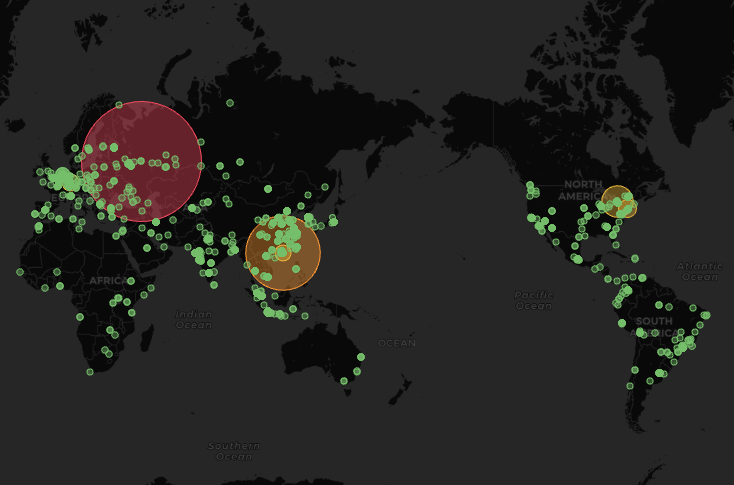

# 研究室のサーバーに対するサイバー攻撃元を可視化してみた

## Geo Mapによる攻撃元の可視化

## Zenn記事

[研究室のサーバーに対する攻撃ログを解析してみた-夏休みの自由研究2024](https://zenn.dev/aobaiwaki/articles/db432e6df4f2de)

## Grafanaサーバー

- https://jiyuukenkyu.shaoba.tech/
- 現状センシティブな情報が含まれているわけではないですが、一応ログイン情報は非公開としておきます。
- ご一報いただければ一時的に閲覧用のユーザーを作成します。
